<a href="https://flutter.dev/">
  <h4 align="center">
    <picture>
      
    </picture>
  </h4>
</a>
<h1 align="center">CImaGen</h1>

"What the hell is the difference between them?!"

  
  
  
  

## About CImaGen

Initially, I just needed some simple application to get exif data from an image to view the generation parameters, but then I wanted to do something more that would help me generate images

## What's here?

At the moment, a gallery, a comparison of images and their parameters, a render history and a settings page are available.

### Gallery
An ordinary gallery. You can:
1. View images lol
2. View the actual size of the image, its parameters, and more, including generation parameters
3. Select multiple images to be sent later for comparison
4. Immediately see the type of image, its upscale (if any) and more
5. Working with a remote panel - If your friend has an "sd-webui-infinite-image-browsing" extension, you can view and work with images in the same way as if it were locally on your computer

### Comparison
Comparison allows you to select several images and compare them with each other. It can be very useful to find the best combination of promt, sampler and hires-upscaler. You have:
1. The histogram. We don't know why lol, but maybe it will be useful to someone, for example, when adjusting the color in ComfUI
2. Information about the file. Its compression method, color depth and size
3. Generation parameters. Soon we will add a feature to find errors and solve them
4. Getting images in realtime for comparison

|||
| ------------- | ------------- |
| <h4>Find the difference</h4> The brighter the area, the more strongly it is changed  | 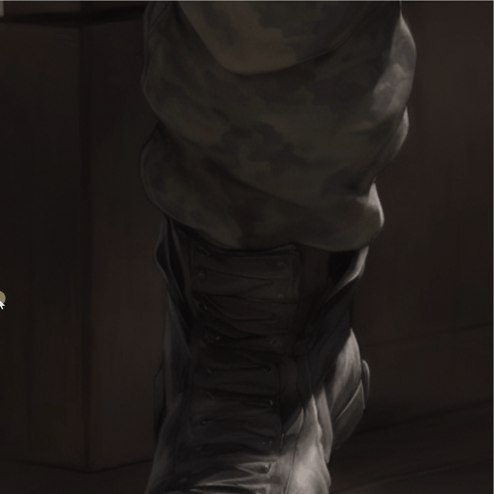  |
| <h4>Split view</h4> Put the images next to each other to choose the best one | 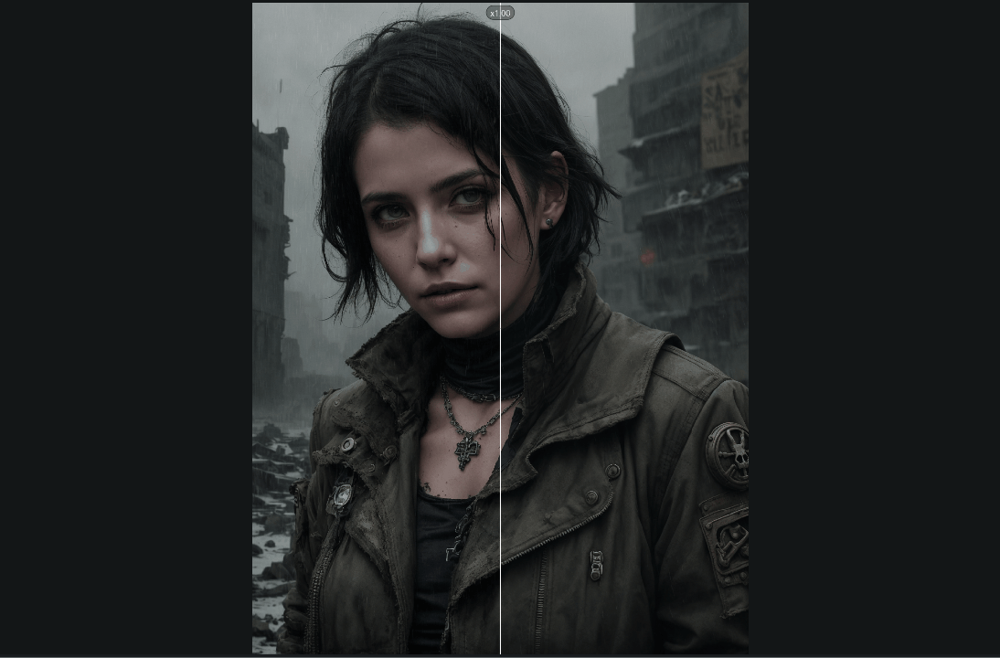  |
| <h4>Reading metadata and generation parameters</h4> Reading data from Topaz Photo AI, Photoshop, NovelAI, ArtBot, Adobe ImageReady, Celsus Studio Tool, Tensor Art, PhotoScape, A1111, SwarmUI, CharacherCard and more | 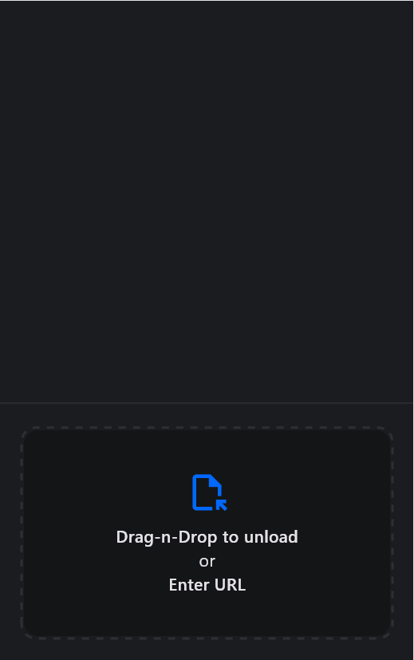  |
| <h4>Notes</h4> As much as you want and whatever you want | 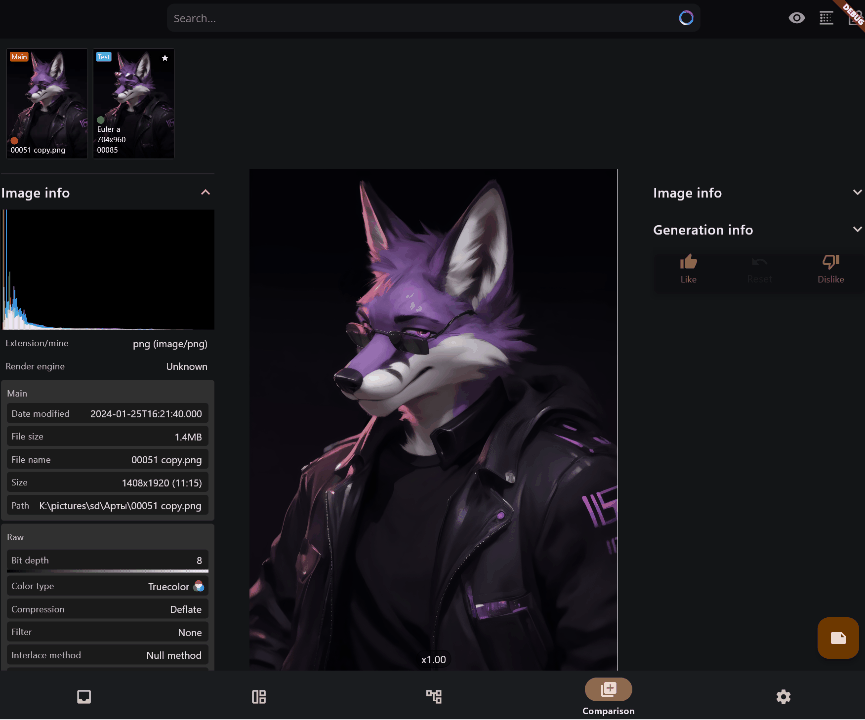  |
| <h4>Histogram and Vectorscope</h4> For those who want to get the desired colors | 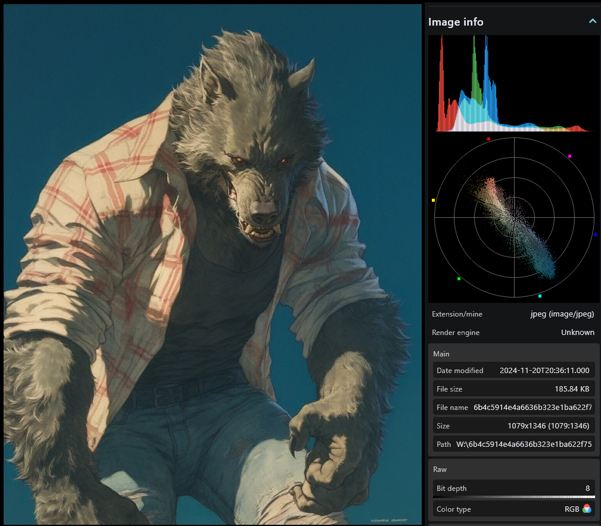  |
| <h4>Connecting to the network UI</h4> You can connect to your computer at home; A1111, SwarmUI, Windows SMB and just parsing, for example, discord - everything in one place and even offline | 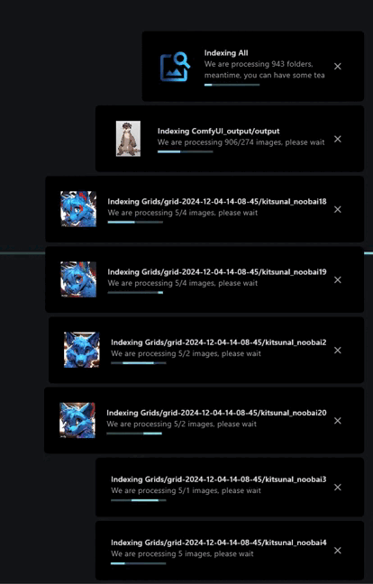  |
| <h4>XYZ rebuilder</h4> Have a bunch of images, but forgot to create an XYZ table or you can’t? Here you can try to recreate using several options depending on the data |   |
| <h4>Prompt analyzer</h4> Beta: Help with building prompt and removing unnecessary tokens, weight charts and more | 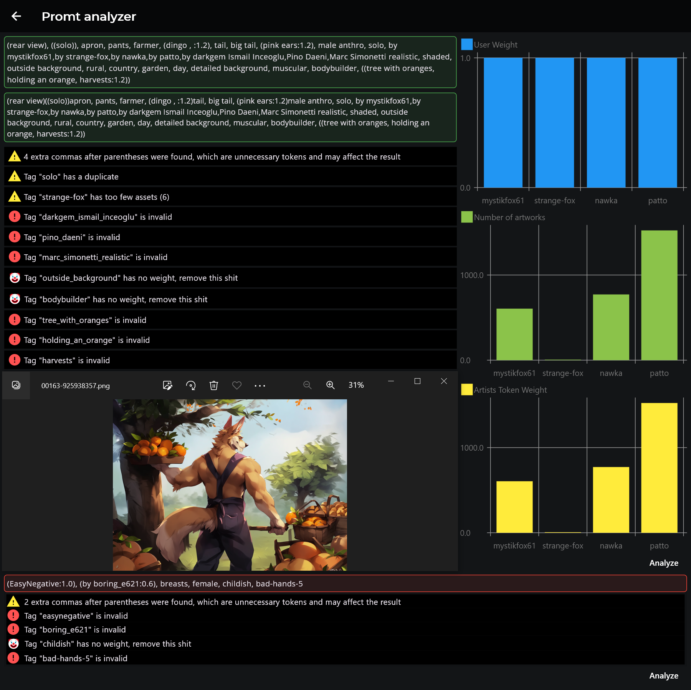  |
| <h4>Transfer of colors</h4> Transferring colors from one image to another |  |
| <h4>Auto contrast and auto color</h4> Adjust color and contrast along the curve automatically, like in Photoshop | 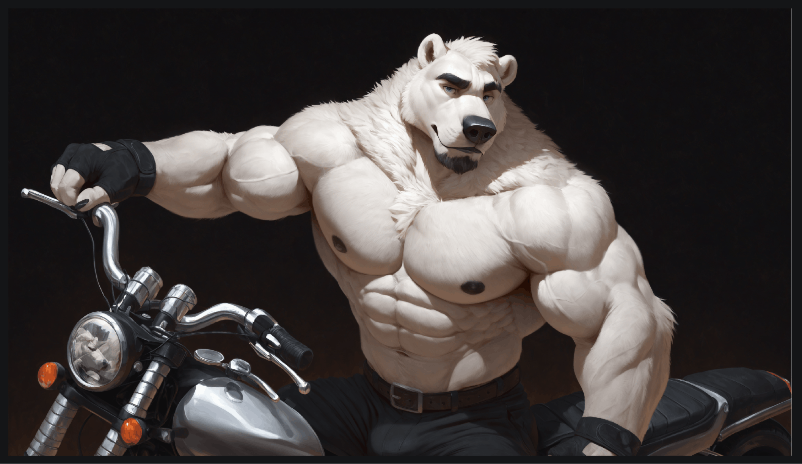  |
| <h4>Image recovery</h4> Even broken ones that can't be opened by other programs |   |
| <h4>LORA manager</h4> Answering simple questions will help you create training configurations + manage existing ones in other systems | 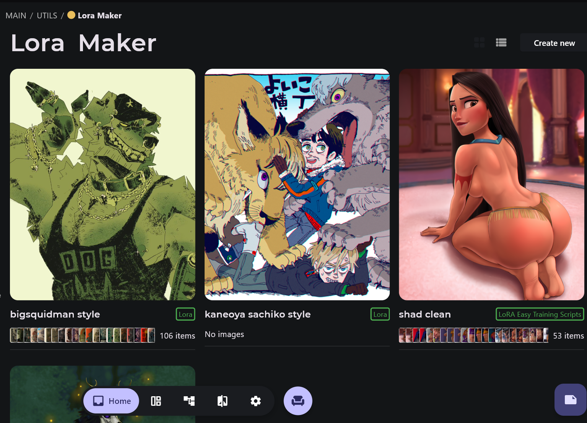  |
| <h4>JointTaggerProject x SauceNAO</h4> Find original images in the best quality and add missing tags without unnecessary programs |   |
| <h4>Preview for devices</h4> See for yourself where your work will look perfect | 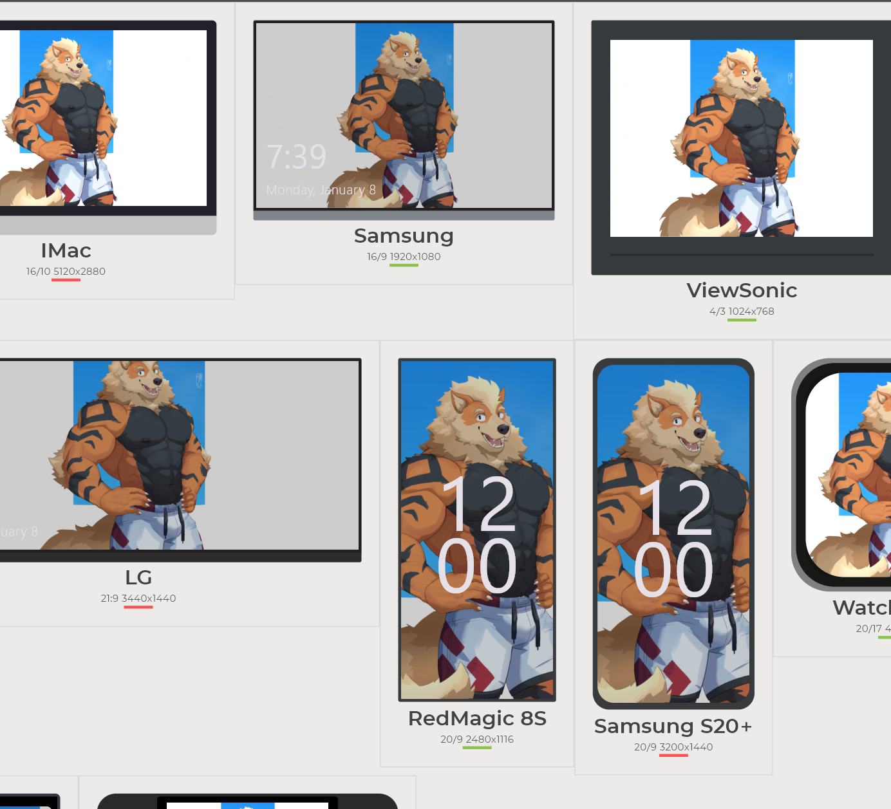  |
| <h4>Print proof (beta)</h4> See instantly how your images will look when printed without opening Photoshop | 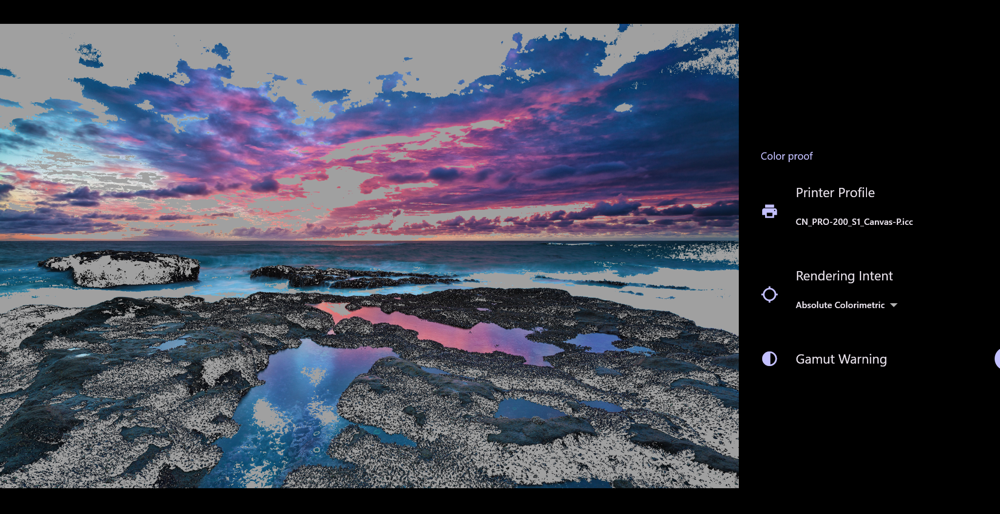  |

### Status
In order not to drown in ideas and bugs, we have a [page](https://github.com/users/ServOKio/projects/6) dedicated to progress.

## Building

> [!WARNING]
> At the moment, the structure of tables in databases is constantly changing, so please do not try to build the application until I deal with this piece of nastiness.

1. Android studio
2. Visual studio 2019 ~16.11 (why 16.11 ? Because the Clang compiler that is needed for the [rive](https://github.com/rive-app/rive-flutter/issues/369#issuecomment-2022541422) plugin is in this version) + "Desktop development with C++"
3. CMake version 3.14.0 (Note: if you are using Visual Studio 2019 and get the error "Could not create named generator Visual Studio 16 2019" then you need to replace CMake inside Visual Studio with version 3.14. Just install CMake 3.14 and replace all files in ~`C:\Program Files (x86)\Microsoft Visual Studio\2022\Community\Common7\IDE\CommonExtensions\Microsoft\CMake\CMake\bin` to 3.14 files)

## Contact
[![Telegram badge][]][Telegram instructions]
[![Discord badge][]][Discord instructions]

[Telegram instructions]: https://t.me/servokio
[Telegram badge]: https://img.shields.io/badge/Telegram-2CA5E0?style=for-the-badge&logo=telegram&logoColor=white
[Discord instructions]: https://discord.gg/hqveSV6wH7
[Discord badge]: https://img.shields.io/badge/Discord-7289DA?style=for-the-badge&logo=discord&logoColor=white
